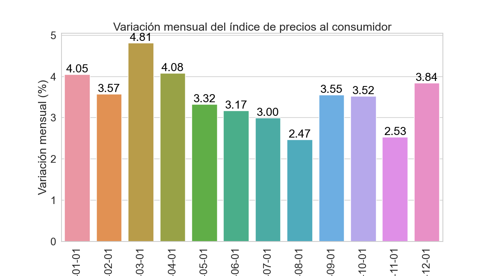

# bda-dev-proy-infla

## Getting started

to use this repository, run the following commands:

```
git clone https://github.com/marcosdh1987/bda-dev-proy-infla.git
git branch -M main
git push -uf origin main
```

## make your own branch to work on

git checkout -b my-branch

# switching back to master branch

git checkout master


## Integrate with your tools

- [ ] [Set up project integrations](https://gitlab.com/marcosdh1987/bda-dev-proy-peya/-/settings/integrations)

## Collaborate with your team

- [ ] [Invite team members and collaborators](https://docs.gitlab.com/ee/user/project/members/)
- [ ] [Create a new merge request](https://docs.gitlab.com/ee/user/project/merge_requests/creating_merge_requests.html)
- [ ] [Automatically close issues from merge requests](https://docs.gitlab.com/ee/user/project/issues/managing_issues.html#closing-issues-automatically)
- [ ] [Enable merge request approvals](https://docs.gitlab.com/ee/user/project/merge_requests/approvals/)
- [ ] [Automatically merge when pipeline succeeds](https://docs.gitlab.com/ee/user/project/merge_requests/merge_when_pipeline_succeeds.html)

## Test and Deploy


## Description
In this overview notebook, we will address business problems regarding "Inflation"


## Objective:


## Situacion actual:


## Roadmap

- [ ] [ETL](ntbk/00-infla-etl.ipynb)
- [ ] [Exploratoy Data Analysis](ntbk/00-infla-eda.ipynb)
- [ ] [Data Modeling - Infla SKlearn Forecaster](ntbk/01-infla-forecaster_sklearn.ipynb)
- [ ] [Data Modeling - BTC SKlearn Forecaster](ntbk/01-BTC_forecaster_sklearn.ipynb)
- [ ] [Machine Learning - LSTM]()

## Prerequisites
- JupyterLab or Sagemaker Studio.

## Authors and acknowledgment
Show your appreciation to those who have contributed to the project.

## License
For open source projects, say how it is licensed.

## Project status

Some visualizations 


